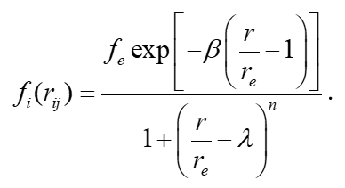
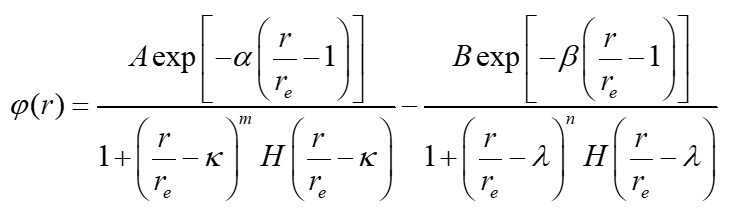
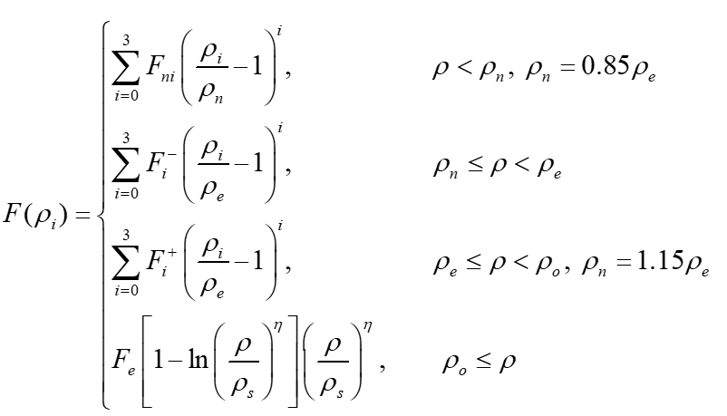

# Explanation of `create_eam.py`

## Overview

The script `create_eam.py` is designed to generate Embedded Atom Method (EAM) potential files for BCC alloy systems. It uses atomic databases to compute pairwise interactions, density functions, and embedding energy terms.

---

## Code Breakdown

### 1. **Imports and Database Access**

```python
from eamDatabase import Database
from eamDatabase import PairData
```

- `Database` and `PairData` store atomic properties and pairwise interaction data.

### 2. **Retrieve Pair Data**

```python
def get_pair_data(element1, element2):
    key = tuple(sorted([element1, element2]))  # Ensures order independence
    return PairData.get(key, None)  # Retrieves pair data if available
```

- Looks up interaction parameters for atomic pairs.
- Ensures elements are always ordered to prevent mismatches.
- Returns `None` if the pair is not found.

### 3. **Heaviside Step Function**

```python
def H(x):
    return np.where(x >= 0, 1, 0)
```

- Implements the Heaviside step function used in potential calculations.

### 4. **Electron Density Function (ρ(r))**

```python
def prof(at, r):
    atom = Database[at]
    f = np.zeros(r.shape)
    mask = r >= 0.5  # Avoids invalid values
    numerator = atom.fe * np.exp(-atom.beta * (r[mask] / atom.re - 1.0))
    denominator = 1.0 + (r[mask] / atom.re - atom.lambd) ** atom.n  
    f[mask] = numerator / denominator
    return f
```

- Computes the electron density contribution for a given atomic species `at`.


### 5. **Pairwise Potential Function (ϕ(r))**

```python
def pair(at1, at2, r):  
    if at1 == at2:
        atom = Database[at1]
    else:
        atom = get_pair_data(at1, at2)
    
    psi1 = atom.A * np.exp(-atom.alpha * (r / atom.re - 1.0))
    psi1 /= (1.0 + ((r / atom.re - atom.kappa) ** atom.m) * H(r / atom.re - atom.kappa))
    psi2 = atom.B * np.exp(-atom.beta * (r / atom.re - 1.0))
    psi2 /= (1.0 + ((r / atom.re - atom.lambd) ** atom.n) * H(r / atom.re - atom.lambd))
    psi = psi1 - psi2
    return psi
```

- Computes the pairwise interaction potential between atoms.
- Uses `get_pair_data` to obtain parameters for mixed pairs.


### 6. **Embedding Function (F(ρ))**

```python
def embed(at, rho):  
    atom = Database[at]
    emb = np.zeros(rho.shape)
    rhon = 0.85 * atom.rhoe
    rhoo = 1.15 * atom.rhoe
    for i, r in enumerate(rho):
        if r == 0:
            emb[i] = 0
        elif r < rhon:
            dr = r / rhon - 1
            emb[i] = atom.Fn0 + atom.Fn1 * dr + atom.Fn2 * dr**2 + atom.Fn3 * dr**3
        elif r < atom.rhoe:
            dr = r / atom.rhoe - 1
            emb[i] = atom.F0 + atom.F1 * dr + atom.F2 * dr**2 + atom.F3_1 * dr**3
        elif r < rhoo:
            dr = r / atom.rhoe - 1
            emb[i] = atom.F0 + atom.F1 * dr + atom.F2 * dr**2 + atom.F3_2 * dr**3
        else:
            dr = r / atom.rhos
            emb[i] = atom.Fe * (1.0 - atom.eta * np.log(dr)) * dr**atom.eta
    return emb
```

- Computes the embedding energy based on the electron density `ρ`.
- Uses different polynomial approximations for various density ranges.


### 7. **Main Function (`create_eam`)**

```python
def create_eam(argv=None):
    ........
    alatmax = max([Database[at].blat for at in atnames])
    rhoemax = max([Database[at].rhoe for at in atnames])
    rc = np.sqrt(2) * alatmax ## BCC Third Nearest Neighbor
    rst = 0.5
    ........
    rhomax = max(rhomax, 2.0 * rhoemax, 100.0)
```

- **Rc** and **rhomax** can modify better

### 9. **Execution Block**

```python
if __name__ == "__main__":
    try:
        elements = ["Hf", "Nb", "Ta", "Ti", "Zr"]  # Properly define elements as strings  
        create_eam(elements)  
    except KeyboardInterrupt as exc:
        raise SystemExit("User interruption.") from exc
```

- Runs `create_eam()` when executed as a script.
- elements = ["Hf", "Nb", "Ta", "Ti", "Zr"] can modify 

---

## Summary

This script generates EAM potentials for BCC alloys by:

1. Retrieving atomic and pair interaction data.
2. Computing density functions, pair potentials, and embedding energies.
3. Writing the formatted results to an output file.

Potential issues include:

- The `get_pair_data` function may not properly retrieve data from `PairData`.
- The `pair` function could fail if `get_pair_data` returns `None`.
- There is a risk of division by zero in `pair` and `embed` calculations.
- `write_file` may need better formatting control to ensure proper spacing.
